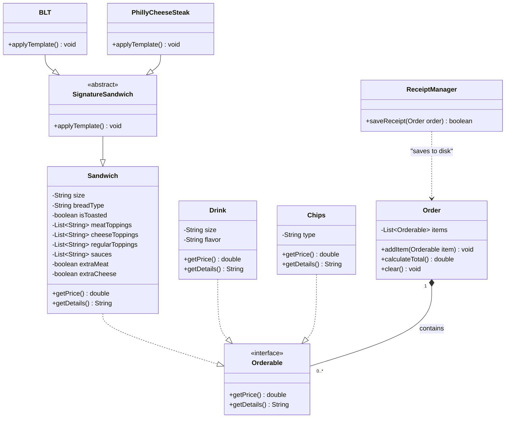

```mermaid
classDiagram
%% 1. Interfaces & Core Contracts
    class Orderable {
        <<interface>>
        +getPrice() double
        +getDetails() String
    }

%% 2. Core Domain Classes
    class Order {
        -List~Orderable~ items
        +addItem(Orderable item) void
        +calculateTotal() double
        +clear() void
    }

    class Sandwich {
        -String size
        -String breadType
        -boolean isToasted
        -List~String~ meatToppings
        -List~String~ cheeseToppings
        -List~String~ regularToppings
        -List~String~ sauces
        -boolean extraMeat
        -boolean extraCheese
        +getPrice() double
        +getDetails() String
    }

    class Drink {
        -String size
        -String flavor
        +getPrice() double
        +getDetails() String
    }

    class Chips {
        -String type
        +getPrice() double
        +getDetails() String
    }

%% 3. Optional Bonus / Advanced Classes
    class SignatureSandwich {
        <<abstract>>
        +applyTemplate() void
    }

    class BLT {
        +applyTemplate() void
    }

    class PhillyCheeseSteak {
        +applyTemplate() void
    }

%% 4. Helper / Utility Layers
    class ReceiptManager {
        +saveReceipt(Order order) boolean
    }

%% 5. Relationships & Associations
%% Interface Realizations (Implementation)
    Sandwich ..|> Orderable
    Drink ..|> Orderable
    Chips ..|> Orderable

%% Dependency / Usage
    ReceiptManager ..> Order : "saves to disk"

%% Composition / Aggregation (Order contains 0 or more Orderable items)
    Order "1" *-- "0..*" Orderable : contains

%% Inheritance (Bonus Challenge Structure)
    SignatureSandwich --|> Sandwich
    BLT --|> SignatureSandwich
    PhillyCheeseSteak --|> SignatureSandwich
```